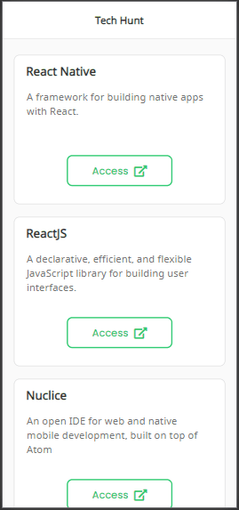
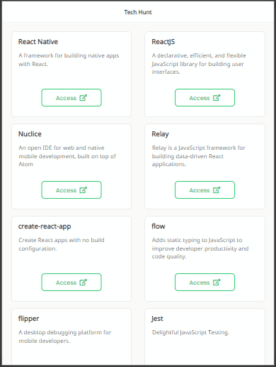
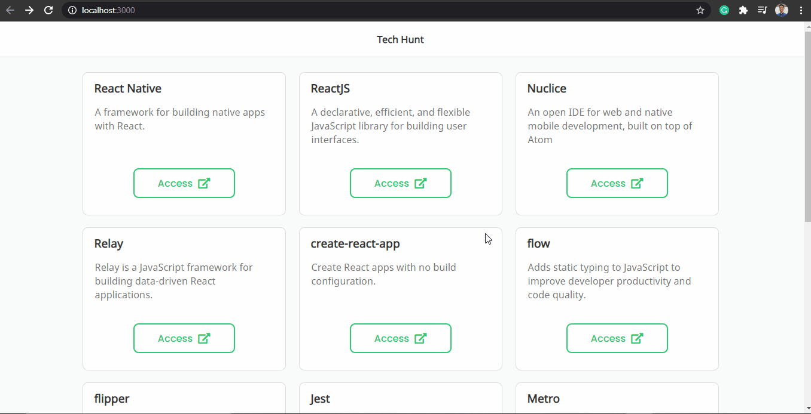

<h1 align="center">Tech Hunt</h1>

<div align="center">
    
    
    
</div>

---

##  About

This is a **React.js front-end page** that searches for technologies. Consuming an API.

This project was inspired by the Rocketseat study platform.

## Technologies

- [HTML5](https://developer.mozilla.org/en-US/docs/Web/Guide/HTML/HTML5)
- [CSS3](https://developer.mozilla.org/en-US/docs/Web/CSS)
- [React.js](https://pt-br.reactjs.org/)
- [Yarn](https://yarnpkg.com/)
- [Axios](https://github.com/axios/axios)

Building
---

````
step 1: Get the clone

step 2: Access the project name

step 3: Type 'yarn start' to start

````
---
Developed by - Renato Souza
